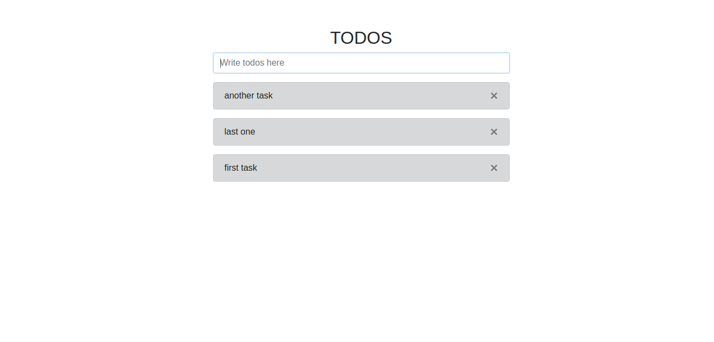

# First Node Express Vue MongoDB APP

This is my first node app which is a todo app. In this small app I was just exploring node. In this I have learnt some basic stuff about this latest framework.

## Technologies
* **Frontend:** Vue JS, Bootstrap, SCSS
* **Backend:** Node JS, Express JS, Mongo DB

## Features
* Created rest API in express
* Add new todo
* Delete old todo
* List of all todos

## Installation
Make Sure MongoDB is running.

#### For server
Run this command on the root directory
> npm run dev

This command will start node server in port 5000

#### For Frontend
First goto frontend directory by using this command
> cd frontend

Now start the development server for vue
> npm run serve

This command will start the server in 8000/8080/8081 port

## Snapshot

